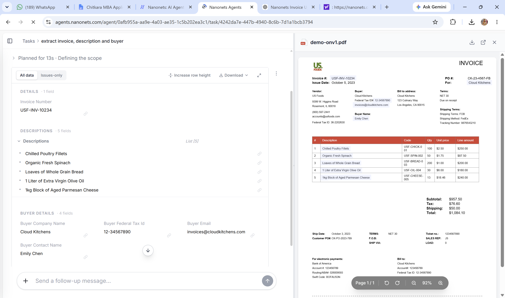
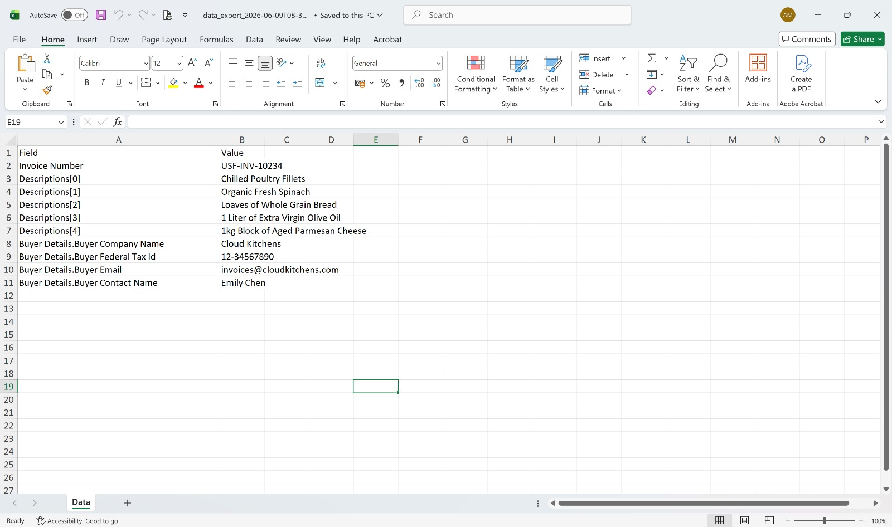

# 📄 Intelligent Invoice Processing with Nanonets

## Project Overview

This project demonstrates an AI-powered Accounts Payable (AP) Automation solution using Nanonets OCR to automatically extract and process information from invoice documents. The system converts unstructured invoice PDFs into structured business data, reducing manual effort and improving operational efficiency.

---

## Technologies Used

- Nanonets OCR
- Artificial Intelligence (AI)
- Optical Character Recognition (OCR)
- Intelligent Document Processing (IDP)
- Invoice Automation
- Microsoft Excel
- Data Extraction

---

## Features

- Automated extraction of invoice data from PDF invoices
- Processes both structured and unstructured documents
- Extracts Invoice Number, Buyer Details, Product Descriptions, Tax Information, and Amounts
- Converts extracted information into structured Excel format
- Reduces manual data entry and processing time
- Supports Accounts Payable (AP) Automation workflows
- Improves invoice processing accuracy and efficiency

---

## Workflow

1. Upload invoice PDFs to Nanonets.
2. Configure extraction fields.
3. Nanonets OCR analyzes the invoice.
4. AI extracts relevant invoice information.
5. Extracted data is validated and structured.
6. Results are exported to Excel for further processing and reporting.

---

## Screenshots

### Invoice Extraction Using Nanonets Agent

The Nanonets AI Agent automatically extracts invoice information such as Invoice Number, Product Descriptions, Buyer Company Details, Tax ID, Email, and Contact Information.

---

### Structured Data Export in Excel

The extracted invoice data is exported into a structured Excel format, making it easier for finance teams to analyze, validate, and integrate data into accounting systems.

---

## Sample Extracted Fields

- Invoice Number
- Product Descriptions
- Buyer Company Name
- Buyer Federal Tax ID
- Buyer Email
- Buyer Contact Name
- Vendor Information
- Tax Details
- Invoice Amount

---

## Business Use Case

Finance and accounting departments process hundreds of invoices every month. Manual extraction of invoice data is time-consuming and prone to errors.

This solution automates invoice data extraction and validation, enabling:

- Faster invoice processing
- Reduced operational costs
- Improved data accuracy
- Better compliance and record management
- Scalable document processing

---

## Business Impact

- Reduced manual invoice processing effort through AI-powered automation.
- Improved extraction accuracy for financial documents.
- Accelerated Accounts Payable workflows.
- Reduced data-entry errors and inconsistencies.
- Increased productivity of finance teams.
- Enabled faster invoice reconciliation and reporting.

---

## Skills Demonstrated

- Optical Character Recognition (OCR)
- Intelligent Document Processing (IDP)
- AI-Powered Automation
- Invoice Data Extraction
- Accounts Payable Automation
- Data Validation
- Business Process Optimization
- Financial Process Automation
- Excel Data Management
- Document Intelligence
- Problem Solving
- Analytical Thinking

---

## Key Learnings

- Understanding OCR and AI-based document processing.
- Extracting structured information from unstructured invoices.
- Designing automated Accounts Payable workflows.
- Validating and managing financial data.
- Improving business efficiency through automation.
- Applying AI solutions to real-world finance operations.
- Exporting and utilizing extracted data for reporting and analysis.

---

## Project Outcome

Successfully developed an AI-powered invoice processing solution using Nanonets OCR that automatically extracts key invoice information and converts it into structured Excel-ready business data. The project demonstrated how Intelligent Document Processing (IDP) can streamline financial operations, improve accuracy, and significantly reduce manual effort.

---

## Future Enhancements

- ERP Integration (SAP, Oracle, Tally)
- Automated Invoice Approval Workflows
- Real-Time Validation Rules
- Dashboard and Analytics Integration
- Multi-Language Invoice Support
- Integration with Accounting Software

---

## Author

**Yogesh**

---

## Repository Topics

`nanonets` `ocr` `invoice-processing` `accounts-payable` `document-automation` `artificial-intelligence` `intelligent-document-processing` `finance-automation` `data-extraction` `excel`
